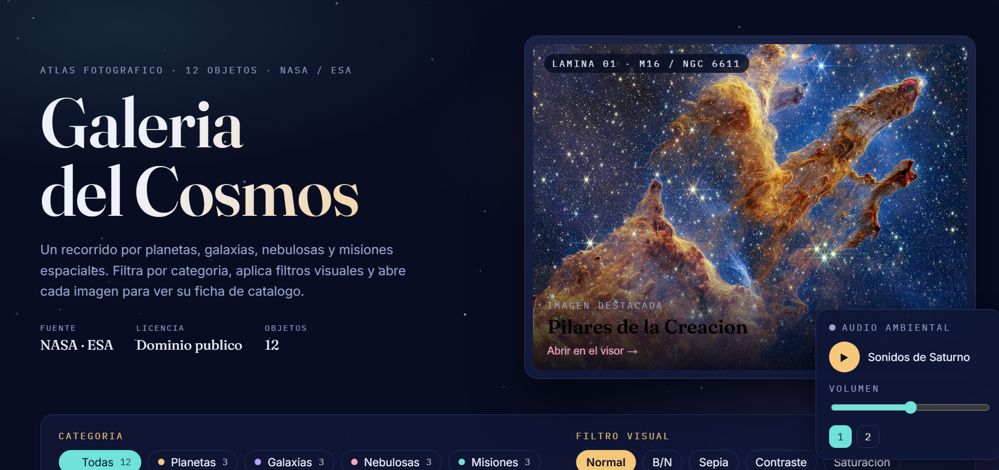
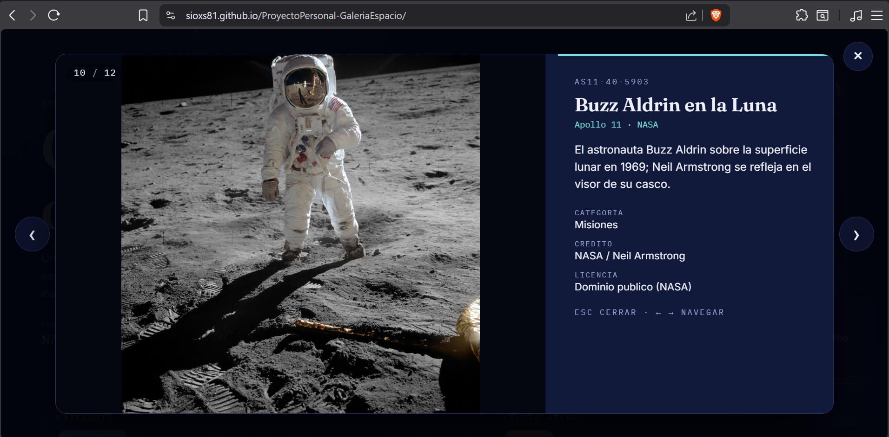
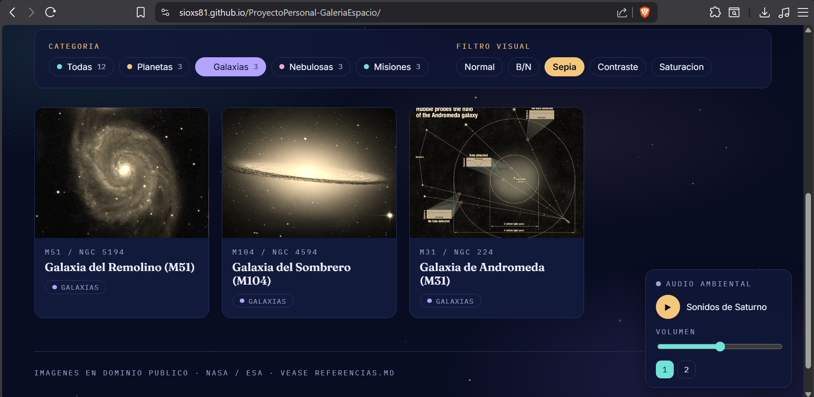
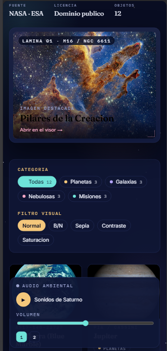

# Galería del Cosmos 🌌

Galería fotográfica interactiva sobre **espacio y astronomía**, con filtros por categoría, filtros visuales CSS, visor ampliado (lightbox), campo de estrellas animado y audio ambiental. Todas las imágenes y audios son de la **NASA / ESA** en **dominio público**.

> **Proyecto Personal — IF7102 Multimedios · I Ciclo 2026**
> Universidad de Costa Rica, Sede Guanacaste
> Autor: **Demian** · GitHub: [@Sioxs81](https://github.com/Sioxs81)

- **Framework elegido:** **Vue 3** (Composition API, `<script setup>`)
- **Opción temática:** **Opción 6 — Galería Fotográfica con Filtros Visuales**
- **Demo en línea (GitHub Pages):** `https://sioxs81.github.io/ProyectoPersonal-GaleriaEspacio/`

---

## ✨ Características

- **Hero tipo "lámina de atlas"** con una imagen destacada que se abre en el visor.
- **Campo de estrellas animado** en `<canvas>` con titileo y deriva (parallax).
- **Filtro por categoría** con código de color y conteo: Planetas, Galaxias, Nebulosas y Misiones (más "Todas").
- **Filtros visuales CSS** aplicados en vivo: Normal, B/N, Sepia, Contraste y Saturación.
- **Lightbox propio** (sin librerías externas) con contador `03 / 12` y teclado: `Esc` cierra, `←` / `→` navegan.
- **Ficha de catálogo** por imagen (objeto, instrumento/misión, crédito y licencia).
- **Audio ambiental** con reproducir/pausar, selector de pista y control de volumen.
- **Datos cargados dinámicamente** desde un archivo JSON con `fetch()`.
- **Diseño responsivo** (escritorio y móvil) y respeto a `prefers-reduced-motion`.

---

## 🛠️ Tecnologías

- [Vue 3](https://vuejs.org/) (Composition API)
- [Vite](https://vite.dev/) como empaquetador y servidor de desarrollo
- CSS plano con variables (sin frameworks de CSS), tipografías de Google Fonts
- [gh-pages](https://www.npmjs.com/package/gh-pages) para el despliegue

---

## 🚀 Cómo ejecutarlo

Necesitás **Node.js 18 o superior**.

```bash
# 1. Instalar dependencias
npm install

# 2. Levantar el servidor de desarrollo
npm run dev
```

Abrí en el navegador la dirección que indica la terminal (por defecto `http://localhost:5173`).

> Las imágenes y audios se cargan desde Wikimedia Commons (NASA/ESA), así que la primera vez se necesita conexión a internet.

### Generar la versión de producción

```bash
npm run build      # genera la carpeta dist/
npm run preview    # sirve localmente la versión de producción
```

### Desplegar en GitHub Pages

```bash
npm run deploy
```

Esto construye el proyecto y publica la carpeta `dist/` en la rama `gh-pages`.
La primera vez, en el repositorio de GitHub: **Settings → Pages → Source → Deploy from a branch → `gh-pages` / root**.

> Nota: el `base` del sitio está en `vite.config.js` como `/ProyectoPersonal-GaleriaEspacio/`. Si cambiás el nombre del repositorio, actualizá ese valor.

---

## 📂 Estructura del proyecto

```
ProyectoPersonal-GaleriaEspacio/
├── index.html
├── vite.config.js
├── package.json
├── public/
│   ├── favicon.svg
│   └── data/
│       └── fotos.json        ← datos cargados con fetch()
└── src/
    ├── main.js
    ├── style.css             ← variables de diseño y nebulosas de fondo
    ├── commons.js            ← helper: URLs de imágenes/audio (Wikimedia Commons)
    ├── categorias.js         ← helper: color de acento por categoría
    ├── App.vue               ← componente raíz (estado + lógica)
    └── components/
        ├── Starfield.vue     ← campo de estrellas animado (canvas)
        ├── FilterBar.vue     ← controles de categoría y filtro visual
        ├── PhotoCard.vue     ← tarjeta reutilizable de cada foto
        ├── Lightbox.vue      ← visor ampliado con teclado
        └── AudioControl.vue  ← reproductor de audio ambiental
```

---

## 🧩 Componentes (6 en total)

| Componente | Responsabilidad | Conceptos de Vue |
|---|---|---|
| `App.vue` | Estado general, carga de datos, filtrado y navegación | `ref`, `computed`, `onMounted`, `fetch` |
| `Starfield.vue` | Campo de estrellas animado de fondo | `ref` a `<canvas>`, `onMounted`/`onUnmounted` |
| `FilterBar.vue` | Cambiar categoría y filtro visual, con conteos | `props`, `emits` |
| `PhotoCard.vue` | Mostrar cada foto y avisar al abrir | `props`, `emits` |
| `Lightbox.vue` | Visor ampliado + atajos de teclado | `props`, `emits`, `onMounted`/`onUnmounted` |
| `AudioControl.vue` | Audio ambiental y volumen | `ref` a un elemento del DOM, `computed` |

---

## 🖼️ Capturas de pantalla

### Vista principal


### Visor (lightbox) con la ficha del objeto


### Filtro visual aplicado


### Verificacion de Responsive



---

## 📚 Créditos y licencias

Todas las imágenes y audios provienen de la **NASA** y la **ESA** y están en **dominio público**.
El detalle completo de cada recurso, las fuentes de documentación consultadas y la declaración del uso de inteligencia artificial están en **[REFERENCIAS.md](REFERENCIAS.md)**.
